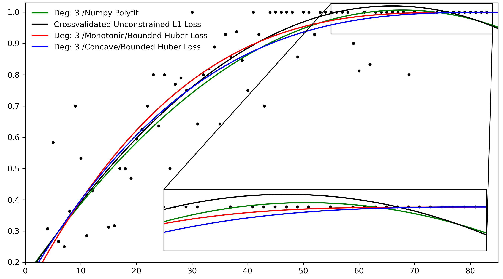

# Polyfit
Scikit learn compatible constrained one dimensional polynomial regression in Python. Multivariate extension upcoming!

Mostly developed for educational purposes, polyfit enables fitting scikit learn compatible one dimensional polynomial regression models under shape constraints.
Under the hood polynomial coefficients are optimized via cvxpy's excellent convex optimizers. 

In particular, the PolynomRegressor estimator provides:
* Robust loss functions: L2, L1, Huber
* Monotonicity constraints
* Curvature constraints (convex/concave)
* Regularization of coefficients: L1, L2 norms (Warning: L2 regularization can cause optimization problems)
* limiting the fitted polynomial to an interval
* Fitting only positive or negative coefficients
* possibility for cross validation over the degree of the polynomial via sklearn's model selection utilities

The constraints however are currently only met in the interval of the training data.

Installation: 

```bash
git clone https://github.com/dschmitz89/Polyfit/
cd Polyfit
pip install .
```
## Usage
Example usage can be found in the test.py file under /polyfit. It produces the following image. 

While unconstrained polynomial fitting results in a decreasing function for high x values, the constraints result in a visually more  convincing fit.



API:
```python
from polyfit import PolynomRegressor
poly = Polynomregressor(deg=None, monotonocity = None, curvature = None, \
                 positive_coeffs = False, negative_coeffs = False, \
		 regularization=None)
poly.fit(x, y, loss = 'l2', m = 1, yrange = None, verbose = False)
pred = poly.predict(x)
```

Polynom regressor attributes: 

deg = Integer > 1. Degree of the polynomial. Note that an offset is always included!

monotonocity = ['positive', 'negative']

curvature = ['convex', 'concave']

positive_coeffs = ['True', 'False']

negative_coeffs = ['True', 'False']

regularization = ['l1', 'l2']

Fit options:

loss = ['l2', 'l1', 'huber']

m = Float. The threshold between l1 and l2 loss for the huber loss and must be tuned to your data

yrange = [min, max] . Range that the fitted polynomial must lie in

verbose = ['True', 'False']

Training data X and y must be one dimensional numpy arrays
